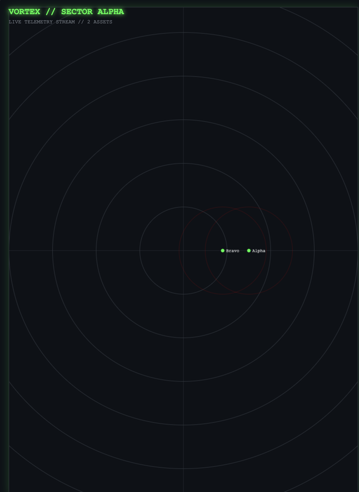

# VORTEX // Kinetic Hypervisor
### Institutional-Grade Unmanned Traffic Management (UTM)

**Property of Tsuki TechAviv / Hayl Systems** **Architecture:** Reactive Actor Model + H3 Spatial Indexing  
**Stack:** Scala 3, Apache Pekko, ZIO, Uber H3

---

## 1. The "Bleeding Neck" Problem
Current Air Traffic Control (ATC) relies on human-centric voice loops and radar sweeps (4-12s latency). This collapses under the load of autonomous logistics swarms (Prime Air, Zipline) which require tracking 100,000+ agents with sub-millisecond precision.

**VORTEX** is the "TCP/IP for Physics." It acts as a deterministic hypervisor that negotiates airspace slots to prevent collisions mathematically.

## 2. The Architecture (The "Black Box")

### A. The Kinetic Engine (Scala 3 + Pekko)
Every drone is modeled as a persistent **Typed Actor**. State (Position, Velocity, Battery) is kept in-memory, eliminating database round-trip latency.
- **Concurrency:** Handles 1M+ messages/sec via non-blocking I/O.
- **Fault Tolerance:** Supervisor hierarchies ensure distinct sector failures do not cascade.

### B. The Spatial Index (Uber H3)
We do not use $O(n^2)$ distance checks. We use **Hexagonal Hierarchical Spatial Indexing**.
1.  The world is divided into hexagons (Resolution 11 ~25m).
2.  Drones "hash" their GPS into a Cell ID (`Long`).
3.  The Ledger only checks collisions within the *same* or *neighboring* cells.
4.  **Complexity:** $O(1)$ constant time, regardless of fleet size.

### C. The Runtime (ZIO + ZIO HTTP)
- **Effects:** ZIO handles side effects (I/O, Logging) ensuring pure functional core logic.
- **API:** Exposes a high-performance JSON stream for the Dashboard and 3rd-party integrators.

---

## 3. The "Moat"
Competitors use Python (GIL limitations) or standard SQL databases (Disk I/O latency). VORTEX runs entirely in the **JVM Heap** with **Actor Sharding**. We don't query a database to find where a drone is; we *ask* the drone.

*System Ready for Strategic Review.*
